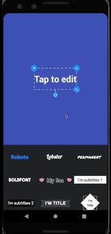

# Scalable-Rotatable-Text

Editable, scalable and rotatable text stickers which support different typefaces and backgrounds. 

Basic operations and different styles: 
  

### Future work
We plan to add emoji stickers which can not be edited in further, and provide a showcase that demonstrates how to combine a sticker with a photo or an video. Moreover, transforming this project from Java to Kotlin is scheduled.
